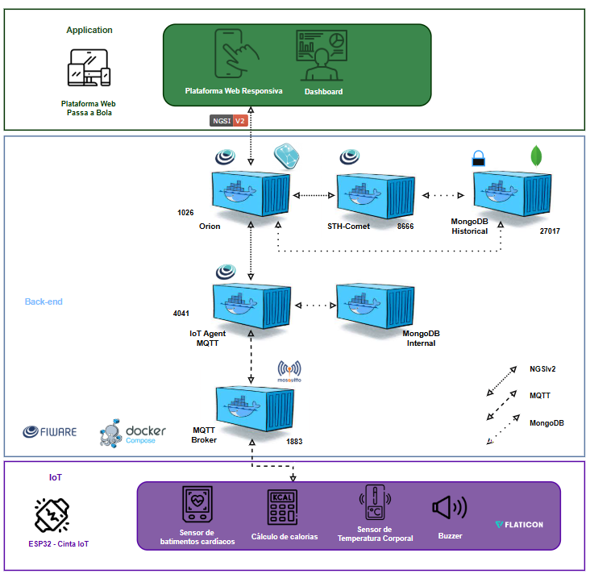

# Cinta Monitora – Passa a Bola

O projeto “Cinta Monitora – Passa a Bola” é um dispositivo vestível IoT desenvolvido para monitorar a saúde de atletas durante treinos e jogos, acompanhando batimentos cardíacos, temperatura corporal e calorias gastas, com alertas sonoros quando os parâmetros estiverem fora da faixa segura.
Acesse o vídeo explicativo aqui: 🎥 [Vídeo Explicativo](https://youtu.be/YxBPRMQJT8o?si=03e3teHxXzNvUPPR) 
---
### 📋 Equipe SmoothPath

- Geovana Maria da Silva Cardoso - 566254
- Gabriel dos Santos Cardoso - 561203
- Gustavo Torres Caldeira - 561613
- Lucas Oliveira Santos - 563617
- Mariana Silva do Egito Moreira - 562544
- 1ESPF - Engenharia de Software
---

### 🛠️ Componentes e Sensores

- ESP32 DevKit – microcontrolador principal

- Potenciômetro – simula batimentos cardíacos

- DHT22 – sensor de temperatura corporal

- Buzzer – alerta sonoro quando parâmetros estão fora da faixa segura

- O sistema também calcula a quantidade estimada de calorias gastas com base nos dados coletados.
---
### 🌐 Arquitetura IoT com FIWARE

A solução foi projetada para funcionar de forma integrada com o FIWARE, utilizando seus Generic Enablers (GEs) em uma máquina virtual (VM).

Fluxo de dados:

- Dispositivo ESP32: coleta batimentos e temperatura e publica via MQTT.

- MQTT Broker (Mosquitto): recebe mensagens dos dispositivos.

- IoT Agent MQTT: traduz os dados MQTT para entidades NGSI.

- Orion Context Broker: armazena e disponibiliza o contexto atual de cada atleta.

- MongoDB Internal: banco interno do Orion para persistência de entidades.

- STH-Comet + MongoDB Historical: registram histórico de dados, permitindo análises de séries temporais.
---
### 📊 Diagrama da Arquitetura

---
### ⚙️ Funcionalidades do Dispositivo

- Monitoramento de batimentos cardíacos em tempo real

- Medição de temperatura corporal

- Cálculo de calorias gastas durante a atividade

- Alertas locais via buzzer quando parâmetros fisiológicos estão fora da faixa segura

- Publicação contínua de dados no broker MQTT, compatível com FIWARE

- Recepção de comandos MQTT, como desativar alerta remotamente
---
### 🔧 Configurações Editáveis

- Wi-Fi: SSID e PASSWORD

- MQTT: IP do broker, porta, tópicos de publicação e assinatura, ID do dispositivo

- Sensores: pinos do potenciômetro (batimentos), DHT22 (temperatura) e buzzer

- Intervalo de leitura: tempo entre leituras dos sensores (padrão 2s)
---
### 🧪 Testes e Validação

Simulação Wokwi: validação do ESP32, sensores e buzzer antes da implementação física

- Postman: testes de integração com FIWARE, incluindo:

- Criação de entidades no Orion Context Broker

- Consulta de dados em tempo real

- Verificação de histórico via STH-Comet

- Simulação de inserção de dados MQTT
---
### ✅ Benefícios do Sistema

- Monitoramento em tempo real dos parâmetros fisiológicos

- Armazenamento histórico para análises futuras

- Segurança das atletas com alertas locais e possibilidade de alertas remotos

- Escalabilidade, permitindo monitorar múltiplos atletas simultaneamente

- Flexibilidade para integração com dashboards ou sistemas externos
---
### 📁 Estrutura do Código

- Configurações: rede Wi-Fi, MQTT e sensores

- Inicializações: serial, Wi-Fi, MQTT e sensores

- Loop principal: leitura de sensores, cálculo de calorias, verificação de parâmetros, envio MQTT

- Funções auxiliares: conexão Wi-Fi/MQTT, leitura de sensores, cálculo de calorias, ativação/desativação de alertas, publicação MQTT
---

## 📎 Links Importantes
🔗 [Projeto no Wokwi](https://wokwi.com/projects/441652276593761281)  
🎥 [Vídeo Explicativo](https://youtu.be/YxBPRMQJT8o?si=03e3teHxXzNvUPPR)  
🎥 [Vídeo da Simulação no Wokwi](https://youtu.be/E-yGx4KFckI?si=Hl1_GvQSrDYp_cuS) 

---

## 📖 Instruções de Uso (Simulação no Wokwi)

### 1️⃣ Acessando a Simulação
1. Abra o link do projeto:  
   🔗 [Simulação no Wokwi](https://wokwi.com/projects/441652276593761281)  
2. Clique em **Start Simulation**.  
3. O ESP32 começará a rodar o código e você poderá visualizar os **logs no Serial Monitor** (à direita da tela).  

---

### 2️⃣ Interagindo com os Sensores
- **Potenciômetro** → simula batimentos cardíacos.  
  - Gire o controle no Wokwi para variar os valores (50–120 BPM).  
- **DHT22** → simula temperatura corporal.  
  - Clique no sensor no Wokwi e altere os valores de **temperatura**.  
- **Buzzer** → emite alerta sonoro.  
  - Quando valores ultrapassarem os limites seguros, o buzzer será ativado automaticamente.  

---

### 3️⃣ Acompanhando os Dados
- Os dados coletados aparecem no **Serial Monitor** em tempo real:  
  - Batimentos cardíacos (BPM)  
  - Temperatura corporal (°C)  
  - Calorias estimadas (kcal)  
- Caso os parâmetros saiam da faixa segura → mensagem de alerta é exibida no log + buzzer ativo.  

---

### 4️⃣ Testando Situações
- **Simular esforço físico**:  
  - Gire o potenciômetro para valores próximos de 120 BPM.  
- **Simular febre**:  
  - Aumente a temperatura do DHT22 para > 38.5°C.  
- **Verificar calorias**:  
  - Deixe a simulação rodando e acompanhe o cálculo de calorias no Serial Monitor.  

---

### 📊 Limites Seguros dos Parâmetros (simulados)

| Parâmetro              | Faixa Segura              | Alerta Ativado se:      |
|-------------------------|---------------------------|--------------------------|
| Batimentos Cardíacos    | 60 – 120 BPM              | < 60 ou > 120 BPM        |
| Temperatura Corporal    | < 38.0°C                  |  > 38.5°C                |

---

### 5️⃣ Integração com FIWARE 

1. Configure o IP do **broker MQTT** no código.  
2. Inicie os componentes na VM: Mosquitto, IoT Agent MQTT, Orion e STH-Comet.  
3. Instale e importe a [Collection Cinta](Munhequeira_PassaBola.postman_collection.json) no Postman para criar entidades no Orion e acompanhar os dados enviados pelo ESP32.  

---

### 6️⃣ Encerrando a Simulação
- Clique em **Stop Simulation** no Wokwi.  
- Todos os dados e logs serão reiniciados ao iniciar novamente.  

---
### 📌 Referências

Código original de: Fábio Henrique Cabrini

Adaptado para o projeto Passa a Bola por: Equipe SmoothPath

Observação: O código e a collection do Postman possuem referências a "Munhequeira Monitora", que era a ideia inicial da equipe. 
